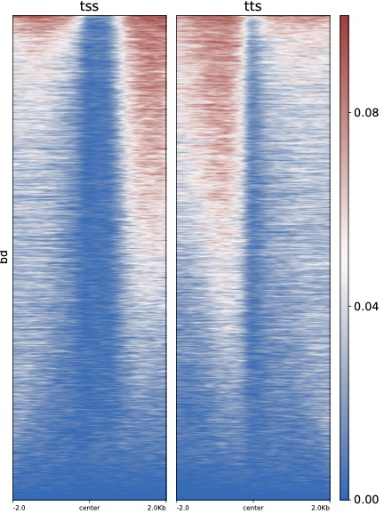

PlotMeth
========

The Basic DNA Methylation (DM) format and dmtools

.. contents:: 
    :local:

python library
--------------

install library required

.. code:: bash

    pip install numpy
    pip install pandas
    pip install matplotlib
    pip install seaborn

bt2basicplot
------------

.. code:: bash

    $ dmtools stats -i sample1.methratio.dm -o prefix1 

    # user also can obtained coverage and levels of CG:
    $ dmtools stats -i sample1.methratio.dm -o prefix1.cg --context 1
      
    $ python3 bt2basicplot.py -c prefix1.cover.txt prefix2.cover.txt -o tt.pdf

.. image:: ../media/plot-basic-coverage.png
   :height: 300 px
   :width: 560 px
   :alt: coverage
   :align: center

.. code:: bash

    $ dmtools bodystats -i prefix1.dm --gff gene.gff -o prefix1.bodym \
        --printcoverage 1

    $ python3 bt2basicplot.py -f prefix1.bodym.cover.cg prefix2.bodym.cover.cg \
        -c prefix1.cover.txt prefix2.cover.txt -o tt.pdf

.. image:: ../media/plot-basic-boxplot.png
   :height: 300 px
   :width: 600 px
   :alt: boxplot
   :align: center

.. image:: ../media/plot-basic-corplot1.png
   :height: 300 px
   :width: 600 px
   :alt: corplot1
   :align: center

.. image:: ../media/plot-basic-corplot2.png
   :height: 300 px
   :width: 360 px
   :alt: corplot2
   :align: center

.. image:: ../media/plot-basic-coverage.png
   :height: 300 px
   :width: 600 px
   :alt: coverage
   :align: center

bt2profile
----------

Plot DNA methlation profile across gene/ TE/ predefined bed region, such as peak or dmr region.
The input DNA methylation level matrix is produced by :doc:`dmtools`.

The *.profile.tss.aver *.profile.acorss.aver and *.profile.center.aver are calulated by :doc:`dmtools`.

.. code:: bash

    $ dmtools profile -i sample1.methratio.dm --bed H3K4me3.bdgene.bed -o H3K4me3.bdgene.profile \
      --regionextend 2000 --bodyX 1 --matrixX 5 --profilemode 1
    
    $ dmtools profile -i sample1.methratio.dm --bed H3K4me3.unbdgene.bed -o H3K4me3.unbdgene.profile \
      --regionextend 2000 --bodyX 1 --matrixX 5 --profilemode 1

    $ bt2profile.py -f H3K4me3.bdgene.profile.tss.aver \
        H3K4me3.unbdgene.profile.tss.aver \
        -l H3K4me3.bdgene H3K4me3.unbdgene \
        --outFileName H3K4me3.output.meth.pdf \
        -s 1 1 -xl up2k TSS down2k --context C 

.. image:: ../media/profile-tss.png
   :height: 300 px
   :width: 400 px
   :alt: profile
   :align: center

.. code:: bash

    $ dmtools profile -i sample1.methratio.dm --bed active.bed -o active.profile \
      --regionextend 2000 --bodyX 1 --matrixX 5 --profilemode 3

    $ dmtools profile -i sample1.methratio.dm --bed random.bed -o random.profile \
      --regionextend 2000 --bodyX 1 --matrixX 5 --profilemode 3

    $ bt2profile.py -f active.profile.center.aver \
        random.profile.center.aver \
        -l active random \
        --outFileName active_random.output.meth.pdf \
        -s 1 1 -xl up2k center down2k

.. image:: ../media/profile-center.png

.. code:: bash

    $ dmtools profile -i sample1.methratio.dm --bed H3K4me3.bdgene.bed -o H3K4me3.bdgene.profile \
      --regionextend 2000 --bodyX 1 --matrixX 5 --profilemode 0
    
    $ dmtools profile -i sample1.methratio.dm --bed H3K4me3.unbdgene.bed -o H3K4me3.unbdgene.profile \
      --regionextend 2000 --bodyX 1 --matrixX 5 --profilemode 0

    $ bt2profile.py -f H3K27me3.bdgene.profile.avarage.across.aver \
        H3K27me3.unbdgene.profile.across.aver \
        -l H3K27me3.bdgene H3K27me3.unbdgene \
        --outFileName H3K27me3.output.meth.pdf \
        -s 1 1 1 -xl up2k TSS TES down2k

.. image:: ../media/profile-body.png
   :height: 300 px
   :width: 400 px
   :alt: profile
   :align: center

bt2heatmap
----------

.. code:: bash

    $ dmtools profile -i sample1.methratio.dm --bed H3K4me3.bdgene.bed -o H3K4me3.bdgene.profile \
      --regionextend 2000 --bodyX 1 --matrixX 5 --profilemode 0
    
    $ python bt2heatmap.py -m H3K4me3.bdgene.profile.cg -l bg \
    -o test0.pdf -z k43 -sl TSS -el TTS

.. image:: ../media/plot-heatmap-0.png
   :height: 380 px
   :width: 200 px
   :alt: heatmap0
   :align: center

.. code:: bash

    $ dmtools profile -i sample1.methratio.dm --bed H3K4me3.bdgene.bed -o H3K4me3.bdgene.profile \
      --regionextend 2000 --bodyX 1 --matrixX 5 --profilemode 1
    
    $ dmtools profile -i sample1.methratio.dm --bed H3K4me3.bdgene.bed -o H3K4me3.bdgene.profile \
      --regionextend 2000 --bodyX 1 --matrixX 5 --profilemode 2

    $ python bt2heatmap.py -m H3K4me3.bdgene.profile.tss.cg H3K4me3.bdgene.profile.tts.cg \
        -l tss tts -o test.pdf --zMax 0.1 --colorMap vlag --centerlabel center -z bd

.. code:: bash

    $ python bt2heatmap.py -m H3K4me3.bdgene.profile.tss.cg H3K4me3.bdgene.profile.tts.cg \
        H3K4me3.unbdgene.profile.tss.cg H3K4me3.unbdgene.profile.tts.cg \
        -l test end -o test2.pdf --zMax 0.05 --centerlabel center \
        --plotmatrix 2x2 --colorList white,red -z bd unbd

.. image:: ../media/plot-heatmap-2.png
   :height: 500 px
   :width: 400 px
   :alt: heatmap0
   :align: center

.. code:: bash

    $ dmtools bodystats --gtf H3K4me3.bdgene.gtf -i ./test.methratio.dm \
      -o H3K4me3.bdgene --strand 3 --context 4 --printcoverage 1

    $ python bt2heatmap.py -f H3K4me3.bdgene.bodym.cover.cg H3K4me3.bdgene.bodym.cover.cg \
        H3K4me3.unbdgene.bodym.cover.cg H3K4me3.unbdgene.bodym.cover.cg \
        -l test end -o test3.pdf --zMax 0.5 --centerlabel center \
        --plotmatrix 2x2 -z bd unbd

.. image:: ../media/plot-heatmap-3.png
   :height: 500 px
   :width: 400 px
   :alt: heatmap0
   :align: center

.. code:: bash

    $ python bt2heatmap.py -m H3K4me3.bdgene.profile.tss.cg H3K4me3.bdgene.profile.tts.cg \
        H3K4me3.bdgene.profile.tss.chg H3K4me3.bdgene.profile.tts.chg \
        H3K4me3.bdgene.profile.tss.chh H3K4me3.bdgene.profile.tts.chh \
        -l H3K4me3.bdgene-tss H3K4me3.bdgene-tts \
        -o H3K4me3.bdgene.TSS_TTS.heatmap.pdf --plotmatrix 3x2 \
        --centerlabel center -z cg chg chh --zMax 0.3 1 0.01

.. image:: ../media/plot-heatmap-4.png
   :height: 500 px
   :width: 400 px
   :alt: heatmap0
   :align: center

.. tip:: DNA methylation level distribution on chromosome (bt2chrplot) and DNA methylation level distribution (bt2visul) are currently being tested, and we will update them as soon as possible.
         
        Note: @HZAU.

.. tip:: For feature requests or bug reports please open an issue `on github <http://github.com/ZhouQiangwei/dmtools>`__.
