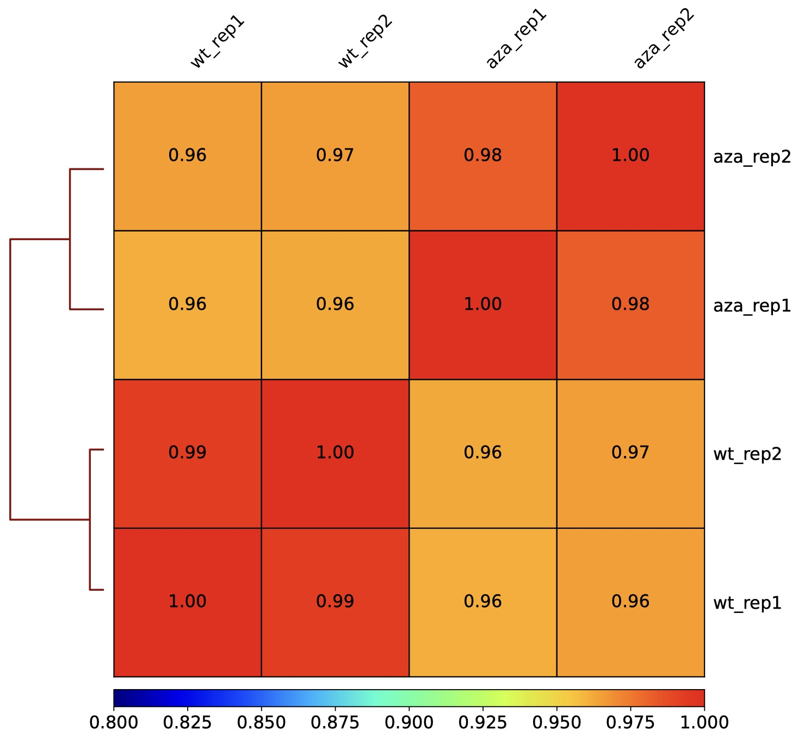
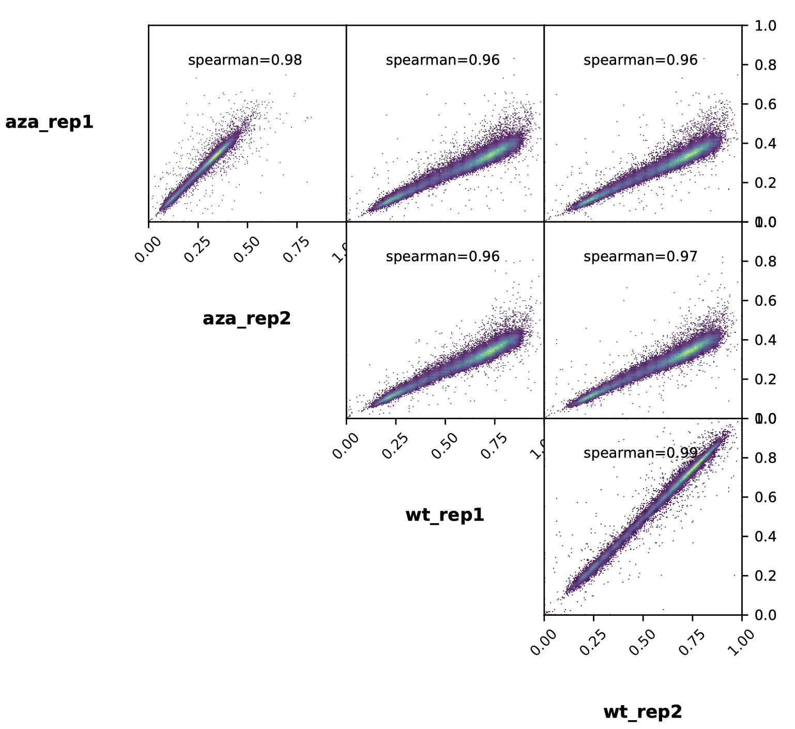

dmPlotCor
=========

.. contents:: 
    :local:

Description
^^^^^^^^^^

In DNA methylation data analysis, calculating the correlation between biological replicates 
and different samples is essential. Biological replicates refer to data obtained by sequencing 
or performing the same experiment multiple times on the same sample. 
By calculating biological replicates, we can evaluate the reproducibility and stability of the data, 
and determine whether changes in methylation levels are due to true biological differences or 
technical noise.

On the other hand, the correlation between different samples can help us evaluate their similarity 
or differences. By calculating the correlation between samples, we can identify which samples 
have similar methylation patterns and which samples exhibit differences. 
This helps us identify critical differential methylation sites and determine the similarity 
and differences in methylation patterns among different samples, 
leading to more accurate conclusions.

Therefore, in DNA methylation data analysis, calculating biological replicates and the correlation 
between different samples is a crucial step that helps us evaluate the reliability and 
consistency of the data.

We can use :doc:`chromstats` to calculate the DNA methylation level in genomic regions 
of different lengths and calculate the correlation between different samples based on the results.

Usage
^^^^^

DMtools provides two visualization options, heatmap and scatterplot, to calculate 
the correlation between DNA methylation data using two methods: Spearman and Pearson.

.. code:: bash

    $ dmtools chromstats -i sample1.zm0.dm -o sample1.chrmeth.txt
    $ dmtools chromstats -i sample2.zm0.dm -o sample2.chrmeth.txt
    # same process for other samples

    $ python3 dmPlotCor.py --plotFile bs.correlation.pdf -m spearman -p heatmap \
        --plotNumbers -f sample1.chrmeth.txt sample2.chrmeth.txt sample3.chrmeth.txt \
        sample4.chrmeth.txt -c CG -l s1_rep1 s1_rep2 s2_rep1 s2_rep2 

scatterplot for correlation visulization

.. code:: bash

    $ python3 dmPlotCor.py --plotFile bs.correlation.pdf -m spearman -p scatterplot \
        --plotNumbers -f sample1.chrmeth.txt sample2.chrmeth.txt sample3.chrmeth.txt \
        sample4.chrmeth.txt -c CG -l AZA_rep1 AZA_rep2 AML_rep1 AML_rep2 \
        --xRange 0 1 --yRange 0 1

Parameters
^^^^^^^^^^

**options:**

``-f BINFILES [BINFILES ...], --binFiles BINFILES [BINFILES ...]``

    the list of input DNA methylation files to merge and plot, must provide -f or -i

``--corMatrix FILE, -i FILE``

    Matrix of DNA methylation values, must provide -f or -i

``--corMethod {spearman,pearson}, -m {spearman,pearson}``
    Correlation method.

``--whatToPlot {heatmap,scatterplot}, -p {heatmap,scatterplot}``

    Choose between a heatmap or pairwise scatter plots

``--context {All,C,CG,CHG,CHH}, -c {All,C,CG,CHG,CHH}``
    DNA methylation context for calculate, All equal to CG+CHG+CHH, C means average of CG/CHG/CHH

``--plotFile FILE, -o FILE``
    File to save the heatmap to. The file extension determines the format, so heatmap.pdf will save the heatmap in PDF format. The
    available formats are: .png, .eps, .pdf and .svg.
``--skipZeros``
    By setting this option, genomic regions that have zero or missing (nan) values in all samples are excluded.
``--skipOnes``
    By setting this option, genomic regions that have DNA methylation 100 percentage values in all samples are excluded.
``--labels sample1 sample2 [sample1 sample2 ...], -l sample1 sample2 [sample1 sample2 ...]``

    User defined labels instead of default labels from file names. Multiple labels have to be separated by spaces, e.g. --labels
    sample1 sample2 sample3

``--plotTitle PLOTTITLE, -T PLOTTITLE``
    Title of the plot, to be printed on top of the generated image. Leave blank for no title. (Default: )

``--plotFileFormat FILETYPE, -pf FILETYPE``
    Image format type. If given, this option overrides the image format based on the plotFile ending. The available options are: png,
    eps, pdf and svg.

**Output optional options:**

``--outFileCorMatrix FILE``
    Save matrix with pairwise correlation values to a tab-separated file.

**Heatmap options:**

``--plotHeight PLOTHEIGHT``
    Plot height in cm. (Default: 9.5)
``--plotWidth PLOTWIDTH``
    Plot width in cm. The minimum value is 1 cm. (Default: 11)
``--zMin ZMIN, -min ZMIN``
    Minimum value for the heatmap intensities. If not specified, the value is set automatically
``--zMax ZMAX, -max ZMAX``
    Maximum value for the heatmap intensities.If not specified, the value is set automatically
``--colorMap``
     Color map to use for the heatmap. Available values can be seen here: http://matplotlib.org/examples/color/colormaps_reference.html
``--plotNumbers``
    If set, then the correlation number is plotted on top of the heatmap. This option is only valid when plotting a heatmap.

**Scatter plot options:**

``--xRange XRANGE XRANGE``
    The X axis range. The default scales these such that the full range of dots is displayed.
``--yRange YRANGE YRANGE``
    The Y axis range. The default scales these such that the full range of dots is displayed.

.. tip:: For feature requests or bug reports please open an issue `on github <http://github.com/ZhouQiangwei/dmtools>`__.
