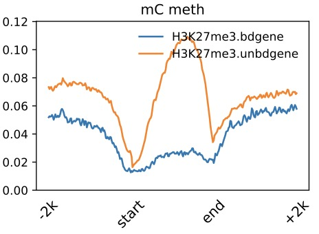

dmPlotProfile
=============

.. contents:: 
    :local:

Description
^^^^^^^^^^

Plot DNA methlation profile across gene/ TE/ predefined bed region, such as peak or dmr region.
The input DNA methylation level matrix is produced by :doc:`profile` command.

Usage and example
^^^^^^^^^

The *.profile.tss.aver *.profile.acorss.aver and *.profile.center.aver are calulated by :doc:`dmtools`.

.. code:: bash

    $ dmtools profile -i sample1.methratio.dm --bed H3K4me3.bdgene.bed -o H3K4me3.bdgene.profile \
      --regionextend 2000 --bodyX 1 --matrixX 5 --profilemode 1
    
    $ dmtools profile -i sample1.methratio.dm --bed H3K4me3.unbdgene.bed -o H3K4me3.unbdgene.profile \
      --regionextend 2000 --bodyX 1 --matrixX 5 --profilemode 1

    $ dmPlotProfile.py -f H3K4me3.bdgene.profile.tss.aver \
        H3K4me3.unbdgene.profile.tss.aver \
        -l H3K4me3.bdgene H3K4me3.unbdgene \
        --outFileName H3K4me3.output.meth.pdf \
        -s 1 1 -xl up2k TSS down2k --context C 

.. image:: ../media/profile-tss.png
   :height: 300 px
   :width: 400 px
   :alt: profile
   :align: center

.. code:: bash

    $ dmtools profile -i sample1.methratio.dm --bed active.bed -o active.profile \
      --regionextend 2000 --bodyX 1 --matrixX 5 --profilemode 3

    $ dmtools profile -i sample1.methratio.dm --bed random.bed -o random.profile \
      --regionextend 2000 --bodyX 1 --matrixX 5 --profilemode 3

    $ dmPlotProfile.py -f active.profile.center.aver \
        random.profile.center.aver \
        -l active random \
        --outFileName active_random.output.meth.pdf \
        -s 1 1 -xl up2k center down2k

.. image:: ../media/profile-center.png

.. code:: bash

    $ dmtools profile -i sample1.methratio.dm --bed H3K4me3.bdgene.bed -o H3K4me3.bdgene.profile \
      --regionextend 2000 --bodyX 1 --matrixX 5 --profilemode 0
    
    $ dmtools profile -i sample1.methratio.dm --bed H3K4me3.unbdgene.bed -o H3K4me3.unbdgene.profile \
      --regionextend 2000 --bodyX 1 --matrixX 5 --profilemode 0

    $ dmPlotProfile.py -f H3K27me3.bdgene.profile.avarage.across.aver \
        H3K27me3.unbdgene.profile.across.aver \
        -l H3K27me3.bdgene H3K27me3.unbdgene \
        --outFileName H3K27me3.output.meth.pdf \
        -s 1 1 1 -xl up2k TSS TES down2k

Parameters
^^^^^

``-f MRFILE [MRFILE ...], --mrfile MRFILE [MRFILE ...]``
                        DNA AverMethylevel files, seperate by space. eg. wildtype.AverMethy.txt
``-l LABEL [LABEL ...], --label LABEL [LABEL ...]``
                        Labels of samples, sperate by space. eg. -l widetype
``--outFileName FILENAME, -o FILENAME``
                        Output file name.
``--sample SAMPLE [SAMPLE ...]``
                        The interval of N data is a group, and the average value is taken as the representative. Please note that the number of labels
                        should correspondto the number of samples after averaging.
``-s SCALE [SCALE ...], --scale SCALE [SCALE ...]``
                        Visual X-axis spacing, default upsteam:body:downstream is 1:1:1 (-s 1 1 1), which should be consistent with -b and -bl parameters
                        in BatMeth2:methyGff,and separated by spaces
``-xl XLABEL [XLABEL ...], --xlabel XLABEL [XLABEL ...]``
                        Consistent with the -s parameter, if the -s parameter is 1 1 1, i.e. 1:1:1,then the corresponding X-axis label is UP TSS TES Down
``-yl YLABEL, --ylabel YLABEL``
                        y-axis label
``-t TITLE [TITLE ...], --title TITLE [TITLE ...]``
                        Title of the plot, to be printed on top of the generated image. Leave blank for no title.
``--yMin YMIN [YMIN ...]``
                        Minimum value for the Y-axis. Multiple values, separated by spaces can be set for each profile. If the number of yMin values is
                        smaller thanthe number of plots, the values are recycled.
``--yMax YMAX [YMAX ...]``
                        Maximum value for the Y-axis. Multiple values, separated by spaces can be set for each profile. If the number of yMin values is
                        smaller thanthe number of plots, the values are recycled.
``--color COLOR [COLOR ...]``
                        List of colors to use, should same as the number of samples,Color names and html hex strings (e.g., #eeff22) are accepted. The
                        color names should be space separated. For example, --color red blue green
``--legend {0,1,2,3,4,5,6,7,8,9,10,11,12}``
                        The location of the legend. best : 0, upper right : 1, upper left : 2, lower left : 3, lower right : 4, right : 5, center left :
                        6, center right: 7, lower center: 8, upper center: 9, center : 10, out : 11, none : 12
``--lastlegend LASTLEGEND``
                        Only show the last figure's legend.
``--legendsize LEGENDSIZE``
                        the text size of the legend.
``--context CONTEXT``
      List of colors to use, should same as the number of samples,Color names and html hex strings (e.g., #eeff22) are accepted. The
                        color names should be space separated. For example, --color red blue green
``--pergroup PERGROUP``  
       plot cg/ch of the same sample in one fig,only useful when have more than 1 sample input file
``-ft IMAGE_FORMAT, --image_format IMAGE_FORMAT``
                        The file format, e.g. 'png', 'pdf', 'svg', ... The behavior when this is unset is documented under fname.
``--dpi DPI``
    Set the DPI to save the figure. default: 200

.. tip:: For feature requests or bug reports please open an issue `on github <http://github.com/ZhouQiangwei/dmtools>`__.
